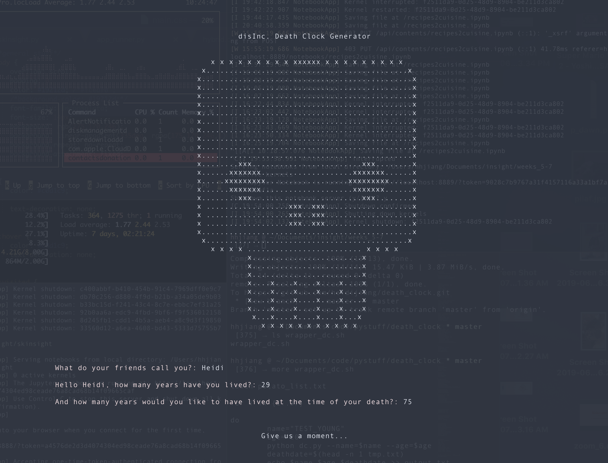
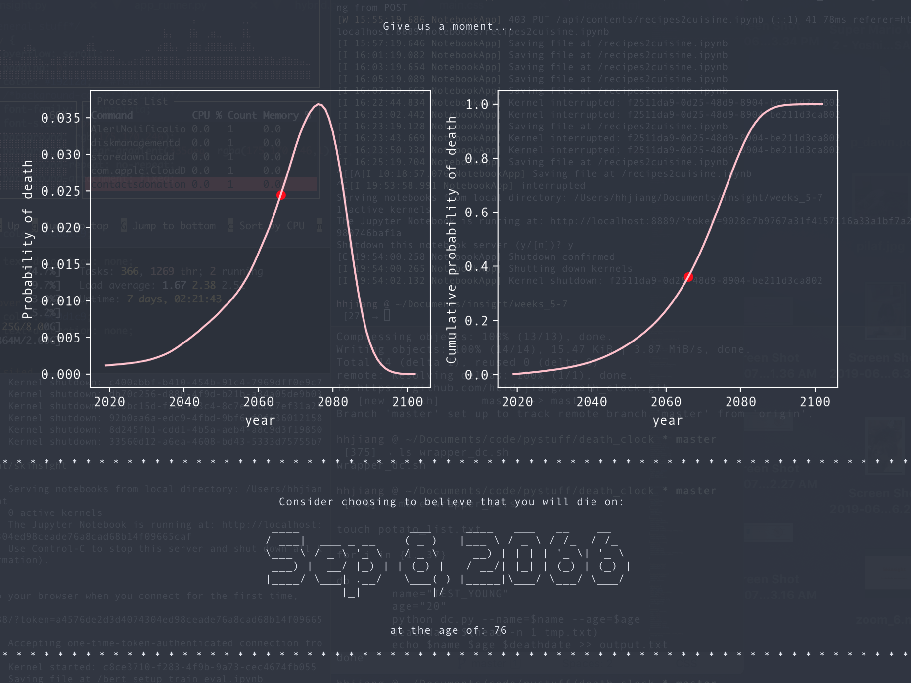

# death_clock
A weird thing that lets you know the date you will die. Made in collaboration with artist <a href="http://www.brnart.com/">Ben Nicholson</a> for his project <a href = "https://www.disincorporated.me/">disincorporated</a>.

To run: bash dc.sh

Requires: figlet, itermplot2, using iterm2

Backend is Python; essentially just generates a random number along true lifespan distributions in the U.S. 
